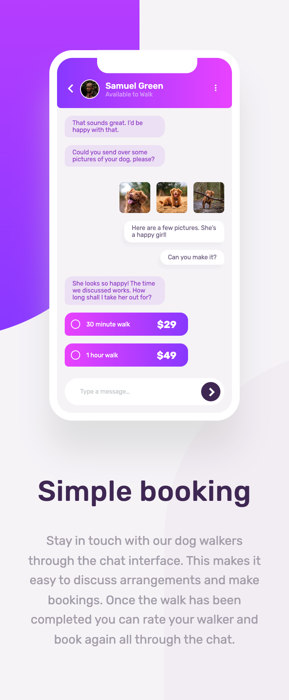

# Frontend Mentor - Chat app CSS illustration solution

This is a solution to the [Chat app CSS illustration challenge on Frontend Mentor](https://www.frontendmentor.io/challenges/chat-app-css-illustration-O5auMkFqY). Frontend Mentor challenges help you improve your coding skills by building realistic projects.

## Table of contents

- [Frontend Mentor - Chat app CSS illustration solution](#frontend-mentor---chat-app-css-illustration-solution)
  - [Table of contents](#table-of-contents)
  - [Overview](#overview)
    - [The challenge](#the-challenge)
    - [Screenshot](#screenshot)
    - [Links](#links)
  - [My process](#my-process)
    - [Built with](#built-with)
    - [What I learned](#what-i-learned)
    - [Useful resources](#useful-resources)
  - [Author](#author)
  - [Acknowledgments](#acknowledgments)

## Overview

### The challenge

- The grid component
- Responsive website
- Background element

### Screenshot

<strong>Mobile View</strong>

<strong>Descktop View</strong>

### Links

- Solution URL: [Chat app CSS illustration with Sass](https://www.frontendmentor.io/solutions/chat-app-css-illustration-with-sass-g0dxwl8AHp)
- Live Site URL: [Frontend-Mentor_chat-app-css-illustration](https://vangmanawkairung.github.io/Frontend-Mentor_chat-app-css-illustration/)

## My process

### Built with

- Semantic HTML5 markup
- CSS custom properties
- Flexbox
- CSS Grid
- Sass/Scss

### What I learned

- The position for the element that used ::before and ::after should use 'relative' while ::before and ::after should be 'absolute'.
- You can used 'float' property to align object.

### Useful resources

- [How to Right Align Div Elements in CSS](https://www.squash.io/how-to-right-align-div-elements-in-css/#:~:text=Using%20the%20“float”%20property%3A,-One%20way%20to&text=The%20“right%2Daligned”%20class,right%20side%20of%20the%20container.) - This website helps me to handle with element alignments
- [linear-gradient()](https://developer.mozilla.org/en-US/docs/Web/CSS/gradient/linear-gradient/) - This website clearifies how to create the gradient for background.
- [box-sizing](https://developer.mozilla.org/en-US/docs/Web/CSS/box-sizing) - This website clearifies position of border.

## Author

- Frontend Mentor - [@VangmanawKairung](https://www.frontendmentor.io/profile/VangmanawKairung)
- GitHub - [VangmanawKairung](https://github.com/VangmanawKairung)

## Acknowledgments

I appreciate to Frontend Mentor Team for spending the time to make this challenge.
